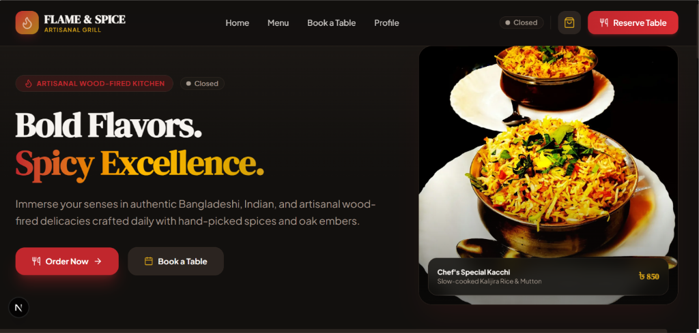
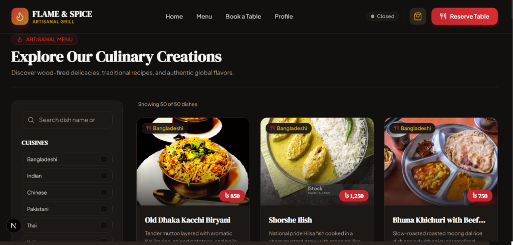
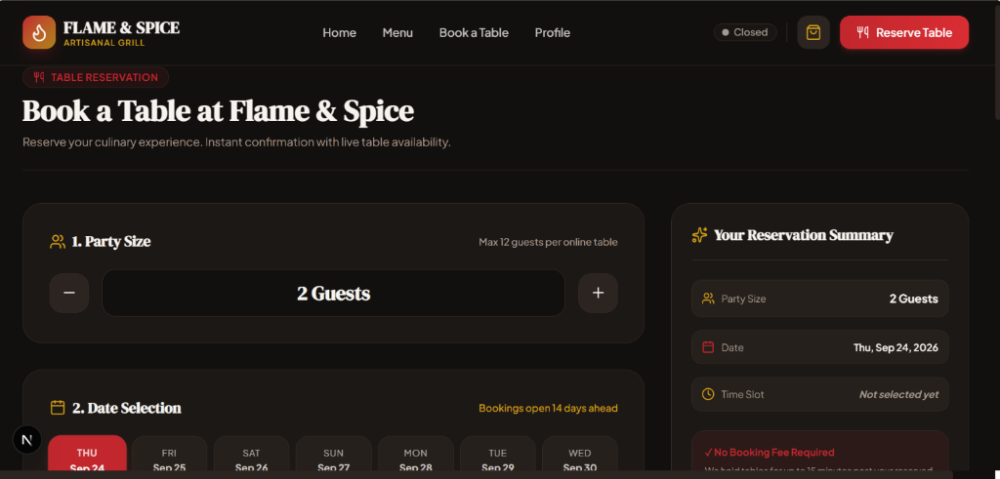
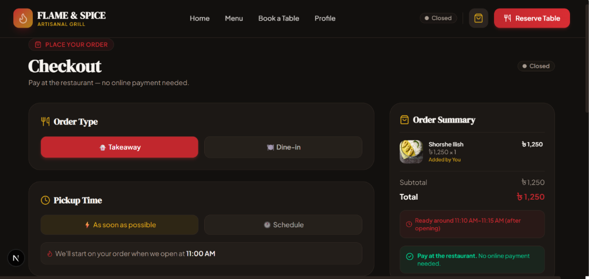

# Flame & Spice — Artisanal Restaurant Web Application

A modern, high-performance restaurant web application built for a hiring technical assessment. Featuring wood-fired artisanal aesthetics, a bold spicy design system, full responsive layout, menu browsing, table reservations, state management, and Vitest test suite.

---

## 📸 Application Screenshots

Save your screenshots in the [`public/screenshots/`](file:///e:/RestauarntTask/public/screenshots/) directory and link them here:

| Landing Page | Menu & Customizations |
| :---: | :---: |
|  |  |

| Table Booking & Waitlist | Group Order & Checkout |
| :---: | :---: |
|  |  |


## 🚀 Tech Stack

- **Framework**: [Next.js 15](https://nextjs.org/) (App Router, TypeScript)
- **Styling**: [Tailwind CSS v4](https://tailwindcss.com/) with custom design tokens
- **Typography**: [`next/font/google`](https://nextjs.org/docs/app/building-your-application/optimizing/fonts) using **DM Serif Display** (Display titles) and **Plus Jakarta Sans** (Body sans)
- **Icons**: [`lucide-react`](https://lucide.dev/) (Curated culinary & restaurant iconset)
- **State Management**: [Zustand](https://zustand-demo.pmnd.rs/) with `safeJSONStorage` local persistence & migration
- **Validation**: [Zod](https://zod.dev/) & [React Hook Form](https://react-hook-form.com/)
- **Testing**: [Vitest](https://vitest.dev/)

---

## 🎨 Design System

The application uses a dark warm charcoal base tailored for an intimate, premium restaurant experience:

- **Primary (`--primary`)**: **Chili Red** (`#C1272D`) — Used for primary CTAs, branding badges, and active highlights.
- **Secondary / Background (`--background`, `--secondary`)**: **Charcoal** (`#12100E` / `#2B2420`) — Deep warm dark mode background.
- **Accent (`--accent`)**: **Spicy Gold** (`#D4A017`) — Used for pricing, ratings, star highlights, and section accents.
- **Typography**: Confident serif headers paired with clean, highly legible body copy.

All tokens are defined in `src/app/globals.css` as CSS variables and Tailwind inline theme tokens for instant maintainability.

---

## 📅 Table Booking System & Rules

The application includes a complete, rule-enforced table reservation system:

### Reservation Rules Matrix

| Rule Parameter | Configuration Value | Description |
| :--- | :--- | :--- |
| **Online Party Limit** | `1 – 12 Guests` | Stepper supports 1 to 30. Parties > 12 display Large Group Card to call host. |
| **Booking Window** | `14 Days` | Reservations open 14 days ahead (`today` to `today + 13`). |
| **Lead Time Cutoff** | `60 Minutes` | Slots starting in < 60 minutes are marked disabled ("Needs 60 min notice"). |
| **Opening Hours** | `11:00 AM – 11:00 PM` | Grouped into Lunch (11:30–15:00) and Dinner (18:00–23:00) slots. |
| **Duplicate Prevention** | `Strict` | 1 active booking or waitlist entry per date & time slot per guest. |
| **Capacity Evaluation** | `Dynamic` | Evaluates base booked + confirmed user seats - released seats. |

### Waitlist Behavior & FIFO Promotion
- When a slot is fully booked or has insufficient seats for a requested party size, guests can join the **Priority Waitlist**.
- Waitlisting provides up to 3 alternative bookable slot suggestions.
- When a table is cancelled or seats open up, the system executes **FIFO (First-In, First-Out)** promotion based on `joinedWaitlistAt` timestamps.
- Promoted guests receive a **Table Offer Banner** allowing one-tap confirmation.

### 🧪 Demo Seat Simulation Tool
Each waitlisted card in *"Your Reservations"* includes a **"Demo: Simulate table opening"** button:
- Clicking this bumps released seats for that date & time.
- Triggers FIFO waitlist evaluation, promoting the waitlisted reservation to `"Offered"` state in real time.

---

## 🍳 Kitchen Status (Simulated Demand Engine)

A passive real-time indicator informing customers of kitchen wait times based on simulated demand:

- **Demand Tiers**:
  - 🟢 **Calm** (10–15 min wait): 11:00, 15:00–17:59
  - 🙂 **Steady** (20–25 min wait): 14:00, 18:00
  - 🟡 **Busy** (30–35 min wait): 12:00, 22:00
  - 🟠 **Rush** (45–50 min wait): 13:00, 19:00, 21:00
  - 🔴 **Full House** (60+ min wait): 20:00
  - ⚪ **Closed**: Outside 11:00 AM – 11:00 PM
- **Location**: Top navigation bar badge, Menu header indicator, and Order Confirmation receipt.

---

## 🛒 Checkout & Order Confirmation Flow

Full front-end checkout and order management (`/checkout`, `/order-confirmation`):

- **Payment Mode**: Clear "Pay at restaurant" notification — no online payment required.
- **Order Types**:
  - **Dine-In**: Select today's active booking (start within last 3h) or input table number (1–20).
  - **Takeaway**: ASAP pickup with live kitchen ETA or scheduled 15-minute slot.
- **Cart Reconciliation**: Verifies prices, menu availability, and enforces `MAX_QTY_PER_ITEM` (20) before checkout.
- **Storage Safety**: Atomic persistence via `useOrderStore` with rollback and error recovery.

---

## 👤 Profile & Demo Tools (`/profile`)

User account management, reservation overview, order history, and developer testing tools:

- **Tab Navigation**: URL query parameter synchronization (`?tab=details|bookings|orders`) with `<Suspense>` wrapper and DOM persistence.
- **Details Tab**: Contact profile management (name, email, phone) with Zod validation.
- **Bookings Tab**: Categorized view of Upcoming (confirmed future), Priority Waitlist & Offers, and Past (completed/cancelled/expired) reservations. Supports cancellation, waitlist management, and table offer confirmations.
- **Orders Tab**: Searchable order history with type chips, derived real-time status (`In progress` vs `Completed`), expandable snapshot dish breakdown, and kitchen demand context.
- **🧪 Demo Tools**:
  - **Load sample history**: Idempotent generator adding 4 sample orders and 5 sample reservations tagged with `isSample` and `FS-SAMPLE-` prefixes without mutating real data.
  - **Reset demo data**: Destructive reset (`resetAllData()`) clearing cart, bookings, waitlist, orders, profile, and seat release state instantly across all Zustand stores.

---

## 🍽️ Landing Page, Food Loaders & Error Resilience

Production home page, food-themed loading states, resilient images, and global error boundaries:

- **Landing Page (`/`)**: Modular architecture featuring Hero with LCP priority photo, live `KitchenStatusBadge`, Cuisine Strip (`/menu?cuisine=<id>`), Signature Dishes (via `getFeaturedDishes()` in `src/data/featured.ts`), How It Works, Visit Us (`OPENING_HOURS` & phone link), and Closing CTA band.
- **Resilient Image Component (`FoodImage`)**: Wraps `next/image` with zero layout shift, loading shimmer overlay, and onError charcoal fallback tile displaying dish name & utensils icon.
- **Menu Query Presets**: Deep-linking support for `?cuisine=`, `?category=`, and `?dietary=` filters pre-selected on page load inside `<Suspense>`.
- **Food-Themed Loading States**: `FoodLoader` animation ("Warming up the kitchen...") and `FoodSpinner` button variant respecting `prefers-reduced-motion`. Route-level `loading.tsx` skeletons for `/menu`, `/book`, `/profile`, `/checkout`, and `/order-confirmation`.
- **Resilient Error Boundaries**: `not-found.tsx` ("This dish is off the menu") and `error.tsx` ("Something burned in the kitchen") maintaining continuous `Navbar` and `Footer` visibility.

---

## 🛠️ Getting Started & Setup Instructions

Follow these steps to run the application locally:

### 1. Clone the Repository
```bash
git clone https://github.com/Fahim7600/RestaurantsOrder.git
cd RestaurantsOrder
```

### 2. Install Dependencies
```bash
npm install
```

### 3. Run Development Server
```bash
npm run dev
```

Open [http://localhost:3000](http://localhost:3000) in your browser to view the application.

### 4. Run Unit Tests (Vitest)
```bash
npm test
```

### 5. Build for Production
To test production compilation:
```bash
npm run build
```

---

## 📱 Mobile Navigation, Accessibility & Quality

Final build pass: mobile bottom tab bar, responsive audit, accessibility, quality gates.

### Mobile Navigation
- **Bottom tab bar** (`MobileTabBar`) below `md` breakpoint with 5 tabs: Home, Menu, Book, Cart (opens cart drawer with live item badge), Profile (offer dot when a table offer is pending).
- Tab bar respects safe areas via `env(safe-area-inset-bottom)` and the `viewport-fit=cover` export in `layout.tsx`.
- Touch targets ≥ 44 px. Content and Footer have global `pb-[60px] md:pb-0` so they are never hidden behind the bar.
- Tab bar hides while a text input is focused (on-screen keyboard) and restores on blur.
- Hamburger / mobile dropdown removed; the top navbar on mobile shows logo + "Book" CTA only.

### Accessibility
- **Visible focus rings**: `:focus-visible` global rule uses `--accent` colour so keyboard users always see where they are; mouse users are unaffected.
- **Skip to main content**: always-present off-screen link visible on first Tab keypress.
- **ARIA**: all icon-only interactive elements have `aria-label`; `aria-current="page"` on active tab; badge counts conveyed via `aria-label`.
- **Reduced motion**: `@media (prefers-reduced-motion: reduce)` collapses all animations and transitions globally.
- **Semantic HTML**: `<header>`, `<nav aria-label="…">`, `<main id="main-content">`, `<footer>` landmarks on every page.

### Quality Gates
- `npm run lint` — 0 ESLint errors.
- `npx tsc --noEmit` — 0 TypeScript errors.
- `npm test` — all unit tests pass.
- `npm run build` — production build compiles cleanly.

---

## 📄 Design Decisions

See [`DECISIONS.md`](./DECISIONS.md) for the reasoning behind framework choice, state management architecture, simulated features, and accessibility/mobile navigation decisions.

---

## 🚢 Deployment

This application is designed and configured for zero-config deployment on **Vercel**.

- **Deployment Target**: Vercel Platform
- **Live Preview URL**: `TBD` (Will be updated upon deployment)
